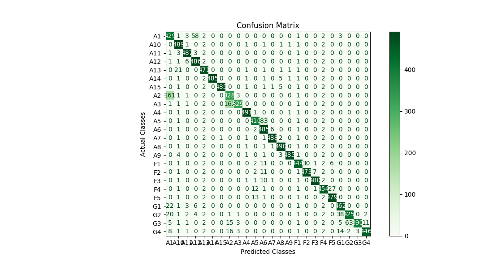

# matching based classification
This code use the matching method to propagate tufts class information from the reference image (with annotations) to the other target images (unknown annotations).

## Pipeline
- key point detection: The sift detector is applied to extract key points from the reference image and target image.
- matching: The corresponding point pairs are found and registered.
- calculate transformation matrix: Ransac method is applied to remove the outliers and the point pairs with most confidence are used to calculate the transformation matrix (affine transformation)

## Result
This algorithm is evaluated on 499 images with total 11656 tufts.
- Accuracy: 0.9094021376085505, 
- Recall: 0.9094021376085503, 
- Precision: 0.9164248713097324, 
- F1: 0.9097646946495005

The confusion matrix is shown as follows:



## How to use

### Environment:

```bash
python 3.8
pycm
matplotlib
scipy
xml
numpy
opencv-python
```

### Code

To visualize the image registration result, modify the `source_path` and `target_path` in `image_registration.py`. Then 

```bash
python image_registration.py
```

To evaluation the classification performance, modify the `dataset` and `annotation_dir` in `affine_matching.py`, then

```sh
python affine_matching.py
```

To predict the tufts in a target image, set `EVALUATION=False` in `affine_matching.py`, then

```bash
python affine_matching.py
```


## Reference

some of the code is referred from [ImageRegistraction](https://github.com/quqixun/ImageRegistration)