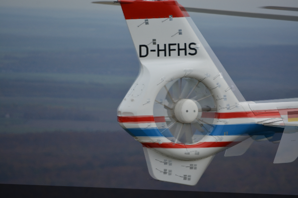
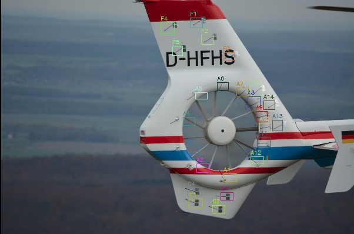

# matching based classification
This code use the matching method to propagate tufts class information from the reference image (with annotations) to the other target images (unknown annotations).

## Pipeline
- key point detection: The sift detector is applied to extract key points from the reference image and target image.
- matching: The corresponding point pairs are found and registered.
- calculate transformation matrix: Ransac method is applied to remove the outliers and the point pairs with most confidence are used to calculate the transformation matrix (affine transformation)

## Result
### Classification

This algorithm is evaluated on 499 images with total 11656 tufts.

- Accuracy: 0.9094021376085505, 
- Recall: 0.9094021376085503, 
- Precision: 0.9164248713097324, 
- F1: 0.9097646946495005

The confusion matrix is shown as follows:


### object detection

We transform the left top and right bottom points of the bounding box in reference image to predict the bounding box of test image. 

- mAP is 53.61%

More detailed evaluation results can be found in `evaluation/results.txt`

#### error cases

Due to the distortion of the test image, sometimes the registration method can not handle this case. Therefore, the not perfect matching leads to the wrong project of bounding box. See the examples below.





## How to use

### Environment:

```bash
python 3.8
pycm
matplotlib
scipy
xml
numpy
opencv-python
```

### Code

- To visualize the image registration result, modify the `source_path` and `target_path` in `image_registration.py`. Then 

```bash
python image_registration.py
```

- To evaluation the classification performance, modify the `dataset` and `annotation_dir` in `affine_matching.py`, then

```sh
python affine_matching.py
```

- To evaluation the object detection performance, firstly you should generate the annotations and prediction results in standard format, (e.g. pascalvoc format). Then, use the python [library](https://github.com/rafaelpadilla/Object-Detection-Metrics) to evaluate the performance. 
  
  - 1. Set the `evaluation=True` and `metric=box` in `affine_matching.py`. Then generate the txt files by running
  
    ```bash
    python affine_matching.py
    ```

- - 2. Download and install the  python [library](https://github.com/rafaelpadilla/Object-Detection-Metrics)  and run

    ```bash
    python pascalvoc.py -gt affine_matching/gt_txt/ -det affine_matching/pred_txt/ -gtformat xyrb -detformat xyrb -np
    ```

- To predict the tufts in a target image, set `EVALUATION=False` in `affine_matching.py`, then

```bash
python affine_matching.py
```


## Reference

some of the code is referred from [ImageRegistraction](https://github.com/quqixun/ImageRegistration)